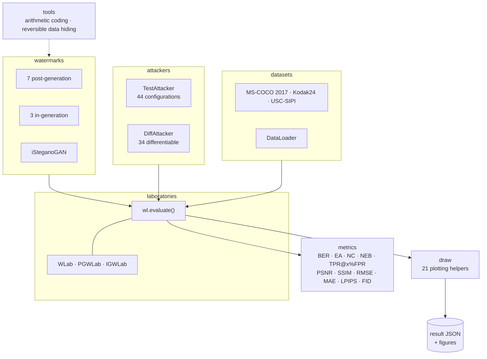

<div align="center">


# WatermarkLab

**Benchmark and develop robust image watermarking — embed, attack, extract, score, plot.**

[](https://pypi.org/project/watermarklab/)
[](https://pypi.org/project/watermarklab/)
[](https://watermarklab.github.io/pages/license.html)
[](https://watermarklab.github.io/)
[](https://pypi.org/project/watermarklab/)
[](https://pypi.org/project/watermarklab/)

[Documentation](https://watermarklab.github.io/) ·
[API reference](https://watermarklab.github.io/pages/api-document.html) ·
[Report a bug](https://github.com/watermarklab/watermarklab.github.io/issues)

</div>

---

**WatermarkLab** is a benchmarking and development framework for robust image watermarking. It covers
both **post-generation** watermarking (embed into an existing image) and **in-generation**
watermarking (embed while a diffusion model samples), and puts embedding, visual-quality
measurement, a calibrated attack sweep, extraction and scoring behind a single call. Everything a
run produces is written to one JSON report, which the built-in plotting module turns into
robustness curves, rankings and visual comparisons.

```
                       ┌──────────────────────────────┐
   dataset ──▶ DataLoader ──▶ watermark model.embed ──▶ protected images
                       └──────────────────────────────┘
                                      │
                                      ▼
                        ┌──────────────────────────┐
                        │  44 attack configurations │  (7 groups, each at
                        │  34 differentiable attacks│   several strengths)
                        └──────────────────────────┘
                                      │
                                      ▼
                       ┌───────────────────────────────┐
   metrics ◀── model.extract ◀── attacked images ──────┘
   BER · EA · NC · NEB · TPR@x%FPR · PSNR · SSIM · RMSE · MAE · LPIPS · FID
                                      │
                                      ▼
                    one JSON report per model ──▶ 21 plotting helpers
```

## Contents

- [Features](#features)
- [Architecture](#architecture)
- [Installation](#installation)
- [Quick start](#quick-start)
- [Evaluate your own watermark](#evaluate-your-own-watermark)
- [Evaluate your own attacker](#evaluate-your-own-attacker)
- [Metrics](#metrics)
- [Attackers](#attackers)
- [Visualization](#visualization)
- [Project layout](#project-layout)
- [Responsible use](#responsible-use)
- [License](#license)

## Features

| | |
|---|---|
| 🎯 **One entry point** | `wl.evaluate()` runs the whole pipeline. It inspects the dataloader and routes to the post-generation or in-generation path by itself. |
| 🖼️ **11 watermark models** | Seven post-generation — DctDwt, DctDwtSvd, RivaGAN, StegaStamp, TrustMark, InvisMark, VINE — three in-generation — Tree-Ring, GaussianShading, StableSignature — plus iSteganoGAN. |
| ⚔️ **44 attack configurations** | Seven groups: compression (classic and learned), adversarial embedding, noise, blur, geometric, colour, and diffusion regeneration. Every attack is swept over several calibrated strengths. |
| 🧬 **34 differentiable attackers** | `DiffAttacker` layers for end-to-end adversarial training: differentiable JPEG (mask / polynomial / Fourier rounding), Gaussian noise, colour and geometric transforms, screen-capture PIMoG and print-capture StegaStamp. |
| 📊 **10 metrics** | Robustness (BER, EA, NC, NEB, TPR@x%FPR) and imperceptibility (PSNR, SSIM, RMSE, MAE, LPIPS), plus FID for in-generation runs. |
| 🗂️ **5 datasets, 5 loaders** | MS-COCO 2017 images and captions, Kodak24, USC-SIPI, with `DataLoader` and four specialised loaders for decoding and attack testing. |
| 📈 **21 plotting helpers** | Robustness curves per attack, model and attacker rankings, visual-quality violins, stego and attack visualisations. |
| 🧩 **Extensible by subclassing** | Seven base classes — `BaseWatermarkModel`, `BaseTestAttackModel`, `BaseDiffAttackModel`, `BaseMetric`, `BaseDataset`, `AttackerWithFactors`, `Result`. |
| 🔧 **Research tools** | Arithmetic coding and reversible data hiding utilities, for methods that must also recover the original cover losslessly. |

## Architecture

The package is a set of independent modules that the evaluation laboratories compose.



| Module | Responsibility |
|---|---|
| `laboratories` | The evaluation platform. `wl.evaluate()` and `WLab` orchestrate a run; `PGWLab` and `IGWLab` implement the two pipelines. |
| `watermarks` | The eleven reference models, plus the base classes every method implements. |
| `attackers` | `testattackers` (benchmarking) and `diffattackers` (training), and the `AttackersWithFactorsModel` collection that binds attacks to their strength sweeps. |
| `metrics` | Robustness and imperceptibility metric classes, and a base class for your own. |
| `datasets` | The benchmark datasets and the loaders that pair data with watermark bits. |
| `tools` | Arithmetic coding and reversible data hiding, for robust reversible watermarking. |
| `draw` | Everything that turns a result JSON into a figure. |

## Installation

```bash
pip install watermarklab
```

Pre-trained weights and the base diffusion models used by the in-generation benchmarks:

```bash
huggingface-cli download chenoly/watermarklab
huggingface-cli download stabilityai/stable-diffusion-2-1-base
huggingface-cli download stabilityai/stable-diffusion-2-1
```

Requires **Python ≥ 3.9**. The dependency set is large because the benchmarks are:

| Group | Packages |
|---|---|
| Core | `numpy`, `pillow`, `opencv-python`, `PyWavelets`, `scikit-learn`, `psutil`, `py-cpuinfo`, `colorama`, `pyfiglet`, `pycryptodome` |
| Metrics | `clean-fid`, `lpips`, `matplotlib`, `seaborn` |
| Models | `torch`, `onnxruntime-gpu`, `diffusers`, `transformers`, `accelerate`, `peft`, `compressai`, `kornia`, `nvidia-ml-py` |

> A CUDA device is expected: FID defaults to `fid_device="cuda"` and the in-generation benchmarks
> sample through a diffusion model. Use `fid_device="cpu"` only for small smoke tests.

## Quick start

Both families share one entry point. `wl.evaluate()` decides from the dataloader whether your model
is post-generation (images) or in-generation (prompts).

**Post-generation (PGW)**

```python
import watermarklab as wl
from watermarklab.utils.data import DataLoader
from watermarklab.datasets import MS_COCO_2017_VAL_IMAGES
from watermarklab.attackers.attackerloader import AttackersWithFactorsModel
from watermarklab.watermarks.PGWs import rivaGAN

dataset = MS_COCO_2017_VAL_IMAGES(im_size=256, bit_len=32)
dataloader = DataLoader(dataset, batch_size=32)
model = rivaGAN(bits_len=32, img_size=256)
attackers = AttackersWithFactorsModel()

report = wl.evaluate("save_results/PGWs", model, attackers, dataloader, noise_save=True)
```

**In-generation (IGW)**

```python
import watermarklab as wl
from watermarklab.utils.data import DataLoader
from watermarklab.datasets import MS_COCO_2017_VAL_PROMPTS
from watermarklab.attackers.attackerloader import AttackersWithFactorsModel
from watermarklab.watermarks.IGWs import GaussianShading

prompts = MS_COCO_2017_VAL_PROMPTS(bit_len=256)
model = GaussianShading(local_files_only=True)
attackers = AttackersWithFactorsModel()

report = wl.evaluate(
    "save_results/IGWs/", model, attackers,
    DataLoader(prompts, batch_size=128), noise_save=True,
)
```

`report` is a JSON-serialisable dictionary with the model metadata, timing, visual-quality scores,
per-attack robustness and Base64 sample images:

```python
{
  "modelname": "rivaGAN", "modeltype": "PGW", "imagesize": 256, "payload": 32,
  "testdataset": "MS-COCO 2017 VAL IMAGES", "envinfo": {...},
  "time_cost": {"embed": [...], "extract": [...]},
  "visualqualityresult": {"PSNR": ..., "SSIM": ..., "LPIPS": ..., "FID": ...},
  "robustnessresult": {"JPEGCompression": {"BER": ..., "EA": ..., "TPR@0.1%FPR": ...}, ...},
  "visualcompare": {...}
}
```

## Evaluate your own watermark

Subclass `BaseWatermarkModel` and implement `embed`, `extract` and `recover`; the evaluation
pipeline handles the rest.

```python
from typing import Any, List
import numpy as np
import watermarklab as wl
from watermarklab.utils.basemodel import BaseWatermarkModel, Result
from watermarklab.utils.data import DataLoader
from watermarklab.datasets import MS_COCO_2017_VAL_IMAGES
from watermarklab.attackers.attackerloader import AttackersWithFactorsModel


class YourWatermark(BaseWatermarkModel):
    def __init__(self, bits_len: int, img_size: int, modelname: str = "YourModel"):
        super().__init__(bits_len, img_size, modelname)

    def embed(self, cover_list: List[Any], secrets: List[Any]) -> Result:
        """Embed the watermark; return the protected data and the embedded bits."""
        ...

    def extract(self, stego_list: List[np.ndarray]) -> Result:
        """Recover the bits from (possibly attacked) images."""
        ...

    def recover(self, stego_list: List[np.ndarray]) -> Result:
        """Optional — only for reversible watermarking."""
        raise NotImplementedError


model = YourWatermark(bits_len=100, img_size=400)
dataset = MS_COCO_2017_VAL_IMAGES(im_size=400, bit_len=100, image_num=500)
wl.evaluate("save_results/PGWs", model, AttackersWithFactorsModel(),
            DataLoader(dataset, batch_size=64))
```

> `bits_len` and `img_size` must match the dataset. Some reference models constrain the payload —
> rivaGAN and DctDwtSvd require exactly 32 bits.

## Evaluate your own attacker

Subclass `BaseTestAttackModel`, implement `attack`, wrap it in `AttackerWithFactors`, and hand the
collection to `wl.evaluate()`.

```python
from typing import List
import numpy as np
from watermarklab.utils.basemodel import AttackerWithFactors, BaseTestAttackModel
from watermarklab.attackers.attackerloader import AttackersWithFactorsModel


class YourAttacker(BaseTestAttackModel):
    def __init__(self, noisename: str = "YourAttacker"):
        super().__init__(noisename, factor_inversely_related=False)

    def attack(self, stego_img: List[np.ndarray], cover_img: List[np.ndarray],
               factor: float) -> List[np.ndarray]:
        """Apply the distortion; `factor` is the strength for this run."""
        return stego_img


attackers = AttackersWithFactorsModel(default_attackers=[
    AttackerWithFactors(
        attacker=YourAttacker(),
        attackername="YourAttacker",
        factors=[1, 2, 3, 4, 5, 6, 7],
        factorsymbol=r"$\sigma$",
    )
])

wl.evaluate("save_results/PGWs", model, attackers, dataloader)
```

> Set `factor_inversely_related=True` when a larger factor means a **weaker** attack — JPEG or VAE
> compression quality is the classic case, where a higher quality value means less distortion. This
> flag keeps the ranking plots oriented correctly.

## Metrics

| Metric | Kind | Meaning |
|---|---|---|
| `BER` | robustness | Bit Error Rate — share of incorrectly extracted bits. |
| `EA` | robustness | Extraction Accuracy — share of protected images identified correctly. |
| `NC` | robustness | Normalised correlation between embedded and extracted bits. |
| `NEB` | robustness | Normalised error between embedded and extracted bits. |
| `TPR_AT_N_PERCENT_FPR` | robustness | True positive rate at a fixed false-positive rate. Applies to zero-bit and multi-bit watermarks alike, so it compares methods fairly. |
| `PSNR` | quality | Peak signal-to-noise ratio. |
| `SSIM` | quality | Structural similarity. |
| `RMSE` | quality | Root mean squared error. |
| `MAE` | quality | Mean absolute error. |
| `LPIPS` | quality | Learned perceptual similarity. |
| FID | quality | Fréchet Inception Distance, computed in the in-generation pipeline. |

Each metric is a class, so you can pass your own list to `wl.evaluate(vqmetrics=[...],
robustnessmetrics=[...])` or subclass `BaseMetric`.

## Attackers

`AttackersWithFactorsModel()` builds **44 attack configurations** across seven groups:

| Group | Examples |
|---|---|
| Compression — learned | `BMshj2018Factorized`, `BMshj2018Hyperprior`, `MBT2018Mean`, `MBT2018`, `Cheng2020` |
| Compression — classic | `JPEGCompression`, `Multi-JPEG`, `JPEG2000Compression`, `Multi-JPEG2000`, `WebPCompression` |
| Adversarial embedding | `Resnet18EmbAttack`, `ClipEmbAttack`, `KL-VAE8EmbAttack`, `SDXL-VAEEmbAttack` |
| Noise | `GaussianNoise`, `PoissonNoise`, `Salt&PepperNoise`, `PixelDropout` |
| Blur | `GaussianBlur`, `MedianFilter`, `MeanFilter` |
| Geometric | `Resize`, `Rotation`, `FlipAttack`, `Crop`, `Cropout`, `RandomCrop`, `RandomCropout`, `RegionZoom`, `TranslationAttack`, `ShearAttack` |
| Colour | `ContrastReduction`, `ContrastEnhancement`, `ColorQuantization`, `ChromaticAberration`, `GammaCorrection`, `HueShift`, `Darken`, `Brighten`, `Desaturate`, `Oversaturate`, `UnsharpMasking` |
| Diffusion | `Diffusion-Regen`, `Mult-Diffusion` |

Each configuration carries the strength list it is evaluated at, for example
`GaussianNoise` at σ ∈ {0.01, 0.03, …, 0.9} or `JPEGCompression` at q ∈ {90, 80, …, 10}.

## Visualization

Every plotting helper reads the saved result JSON, so you can benchmark first and plot later:

```python
import watermarklab as wl
from watermarklab.attackers.attackerloader import AttackersWithFactorsModel

results = [
    "saved_all_json/result_rivaGAN.json",
    "saved_all_json/result_StegaStamp.json",
    "saved_all_json/result_GaussianShading.json",
]

wl.draw.plot_model_robustness_under_single_attack(results, "draw/MR_SA")
wl.draw.plot_model_robustness_under_all_attack(results, "draw/MR_AA")
wl.draw.plot_model_overall_robustness_ranking(results, "draw/MRK_MO")
wl.draw.plot_attack_effectiveness_at_tpr_levels(
    results, "draw/ARK_TPR", tpr_levels=[0.9, 0.8, 0.7, 0.6, 0.5]
)
wl.draw.plot_visual_quality(results, "draw/VQ", show_dataset_name=False)
wl.draw.plot_stego_visualization(results, "draw/MVC")
```

## Project layout

```
watermarklab/
├── laboratories/     evaluation entry points and the PGW / IGW pipelines
├── watermarks/       11 reference models + base classes
│   ├── PGWs/         DctDwt, DctDwtSvd, RivaGAN, StegaStamp, TrustMark, InvisMark, VINE
│   └── IGWs/         Tree-Ring, GaussianShading, StableSignature
├── attackers/        robustness testing and adversarial training
│   ├── testattackers/    44 benchmark configurations
│   └── diffattackers/    34 differentiable attackers
├── metrics/          robustness and imperceptibility metrics
├── datasets/         MS-COCO 2017, Kodak24, USC-SIPI
├── steganography/    iSteganoGAN
├── tools/            arithmetic coding, reversible data hiding
├── draw/             21 plotting helpers
└── utils/            base classes, loaders, configuration
```

## Responsible use

This package contains watermark-removal methods (the attackers) for benchmarking and for developing
more robust protection. The licence makes their permitted use an explicit condition: do not use them
to strip watermarks from content you are not authorised to modify, to facilitate piracy or content
theft, to bypass provenance or authentication systems in production, or to create deceptive media.
See the [licence](https://watermarklab.github.io/pages/license.html) for the full terms.

## License

Released under the **MIT License with Additional Terms** — a patent grant, a no-trademark clause, an
ethical-use clause covering the attack functionality, third-party model and dataset restrictions,
export compliance, and a DCO requirement for contributions. See `LICENSE` for the full text.

<div align="center">
<sub>WatermarkLab · advancing robust image watermarking research</sub>
</div>

---

## About this repository

This repository publishes the documentation at **<https://watermarklab.github.io/>**. It holds the
generated static site; the library source lives with the Python package.

```
index.html               landing page
pages/api-document.html  quick start, guides and the complete API reference
                         (463 entries, every public symbol, each with a code example)
pages/license.html       licence text
_build/                  the generator
assets/logo.svg          the mark
```

The HTML is produced from the library source by static AST analysis — signatures, defaults and
descriptions all come straight from the code, so the reference cannot drift from the implementation.
To regenerate after changing the library:

```bash
python _build/extract_api.py  <path-to>/watermarklab  _build/api_dump.json
python _build/build_site.py   _build/api_dump.json    <path-to>/figures/logo.svg  .  <path-to>/LICENSE
python _build/verify_docs.py  pages/api-document.html     # optional sanity check
```

`_build/README.md` documents every script. The site is plain HTML with inline CSS — no build step,
no framework, no CDN — so it works offline and from any subdirectory.
